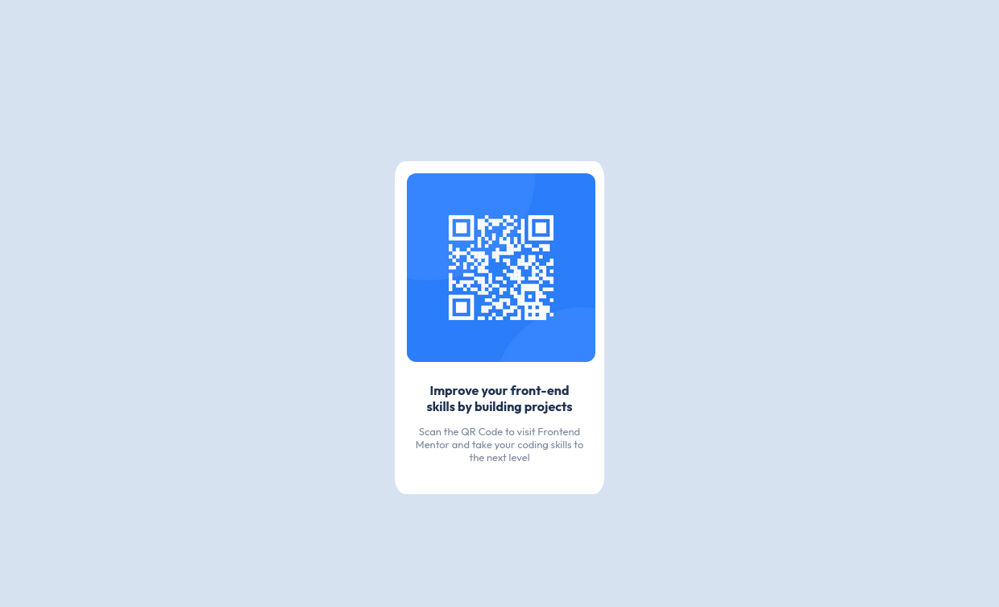

# Frontend Mentor - QR code component solution

This is a solution to the [QR code component challenge on Frontend Mentor](https://www.frontendmentor.io/challenges/qr-code-component-iux_sIO_H). Frontend Mentor challenges help you improve your coding skills by building realistic projects. 

## Table of contents

- [Frontend Mentor - QR code component solution](#frontend-mentor---qr-code-component-solution)
  - [Table of contents](#table-of-contents)
  - [Overview](#overview)
    - [Screenshot](#screenshot)
    - [Links](#links)
  - [My process](#my-process)
    - [Built with](#built-with)
    - [Continued development](#continued-development)
  - [Author](#author)

## Overview

### Screenshot

### Links

- Solution URL: [Add solution URL here](https://github.com/Monge1h/frontend-mentor-challenges/qr-code-component-main/)
- Live Site URL: [Add live site URL here](https://monge1h.github.io/frontend-mentor-challenges/qr-code-component-main/)

## My process

### Built with

- Mobile-first workflow
- HTML
- CSS

### Continued development

In the next projects I will try to use flex or css grid

## Author

- Website - [Jorge Monge](https://www.monge1h.com)
- Frontend Mentor - [@monge1h](https://www.frontendmentor.io/profile/yourusername)
- Twitter - [@monge1h](https://www.twitter.com/monge1h)
